# 🔐 Validação de Login com Testes Unitários (Java + JUnit 5)
 
## 📋 Identificação
 
| Campo | Informação |
|-------|------------|
| **Nome do aluno** | _(Michell Silva Santos)_ |
| **Curso** | _(Análise e Desenvolvimento de Sistemas)_ |
| **Professor(a)** | _(Washington Luis Souza de Anunciação)_ |
| **Data** | _(06/10/2026)_ |
 
---
 
## 📑 Sumário
 
1. [Questões e Regras de Negócio](#1-questões-e-regras-de-negócio)
2. [Testes e Validações de Cada Questão](#2-testes-e-validações-de-cada-questão)
3. [Como o Script Foi Feito](#3-como-o-script-foi-feito)
4. [Dependências Utilizadas](#4-dependências-utilizadas)
5. [Demonstração de Cada Código](#5-demonstração-de-cada-código)
6. [O Que Cada Script Faz](#6-o-que-cada-script-faz)
7. [Estrutura do Repositório](#7-estrutura-do-repositório)
---
 
## 1. Questões e Regras de Negócio
 
### ❓ Quais são as regras de validação de senha (CT01 a CT16)?
 
**✅ Resposta:**
 
| Regra | Descrição |
|-------|-----------|
| **Comprimento** | Mínimo de **10** e máximo de **12** caracteres. Senhas com 9 ou menos, ou com 13 ou mais, são inválidas. |
| **Letra** | Deve conter pelo menos **uma letra**. |
| **Número** | Deve conter pelo menos **um número**. |
| **Caractere especial** | Deve conter pelo menos **um caractere especial** (ex.: `@`, `#`, `$`, `%`). |
| **Nulo / vazio** | Valores `null` ou `""` devem ser rejeitados e retornar `false`. |
 
### ❓ Quais são os requisitos funcionais e de autenticação (RF01 a RF08)?
 
**✅ Resposta:**
 
| Requisito | Descrição |
|-----------|-----------|
| **RF01 / RF08** | Permitir o cadastro de novos usuários com um nível de acesso válido (`ADMIN`, `GERENTE` ou `CLIENTE`). |
| **RF04 / RF06** | Autenticar com login ou senha vazios deve lançar `ValidacaoException`. |
| **RF06** | Autenticar um usuário que não existe deve lançar `NotFoundException`. |
| **RF07** | Após **3 tentativas consecutivas incorretas**, a conta é bloqueada. Qualquer tentativa seguinte lança `ContaBloqueadaException`. |
 
---
 
## 2. Testes e Validações de Cada Questão
 
### ❓ Quais testes foram criados e o que cada um valida?
 
**✅ Resposta:** foram criados **13 testes** na classe `ValidarTeste`. Todos **PASSARAM** ✅.
 
| ID / Requisito | Método de teste | Validação esperada | Asserção | Resultado |
|----------------|-----------------|--------------------|----------|-----------|
| CT01 / CT09 | `testeSenhaValida10Caracteres()` | Aceitar senha válida com 10 caracteres | `assertTrue` | ✅ PASSOU |
| CT02 / CT13 | `testeSenhaMenorQueMinimo()` | Rejeitar senha com 9 caracteres | `assertFalse` | ✅ PASSOU |
| CT10 / CT12 | `testeSenhaLimiteMaximo12()` | Aceitar senha com 12 caracteres | `assertTrue` | ✅ PASSOU |
| CT03 | `testeSenhaMaiorQueMaximo()` | Rejeitar senha com 13+ caracteres | `assertFalse` | ✅ PASSOU |
| CT04 / CT14 | `testeSenhaSemEspecial()` | Rejeitar senha sem caractere especial | `assertFalse` | ✅ PASSOU |
| CT05 / CT15 | `testeSenhaSemLetra()` | Rejeitar senha sem letra | `assertFalse` | ✅ PASSOU |
| CT06 / CT16 | `testeSenhaSemNumero()` | Rejeitar senha sem número | `assertFalse` | ✅ PASSOU |
| CT07 | `testeSenhaNula()` | Tratar `null` | `assertFalse` | ✅ PASSOU |
| CT08 | `testSenhaVazia()` | Tratar string vazia `""` | `assertFalse` | ✅ PASSOU |
| RF01 / RF08 | `testeCadastroUsuarioComSucesso()` | Cadastrar usuário sem lançar exceção | `assertDoesNotThrow` | ✅ PASSOU |
| RF04 / RF06 | `testeAutenticacaoCamposVazios()` | Lançar `ValidacaoException` com campos vazios | `assertThrows` | ✅ PASSOU |
| RF06 | `testeUsuarioInexistente()` | Lançar `NotFoundException` | `assertThrows` | ✅ PASSOU |
| RF07 | `testeBloqueioContaApos3Tentativas()` | `AutenticacaoException` nas 3 falhas e `ContaBloqueadaException` na 4ª tentativa | `assertThrows` | ✅ PASSOU |
 
---
 
## 3. Como o Script Foi Feito
 
### ❓ Quais ferramentas e técnicas foram usadas nos testes?
 
**✅ Resposta:** a suíte foi escrita com **JUnit 5 (Jupiter)** em um projeto **Java** gerenciado pelo **Apache Maven**.
 
**Anotações:**
 
| Anotação | Função |
|----------|--------|
| `@Test` | Marca o método como um teste executável. |
| `@DisplayName` | Define o nome legível exibido na execução (ex.: `"CT01/CT09 - Senha válida com exatamente 10 caracteres"`). |
| `@BeforeEach` | Executa antes de cada teste, criando objetos novos e garantindo que um teste não interfira no outro. |
 
**Estratégias de validação:**
 
| Estratégia | Quando é usada |
|------------|----------------|
| `assertTrue(...)` / `assertFalse(...)` | Verificar o retorno booleano de `validarSenha`. |
| `assertThrows(Exception.class, () -> ...)` | Verificar se uma exceção específica foi lançada. |
| `assertDoesNotThrow(() -> ...)` | Verificar que nenhuma exceção foi lançada. |
 
### ❓ Como é o setup dos testes?
 
**✅ Resposta:** antes de cada teste, o método `setUp()` cria novas instâncias de `ValidarSenha` e `ValidarLogin`.
 
```java
private ValidarSenha validadorSenha;
private ValidarLogin sevicoLogin;
 
@BeforeEach
void setUp(){
    validadorSenha = new ValidarSenha();
    sevicoLogin = new ValidarLogin();
}
```
 
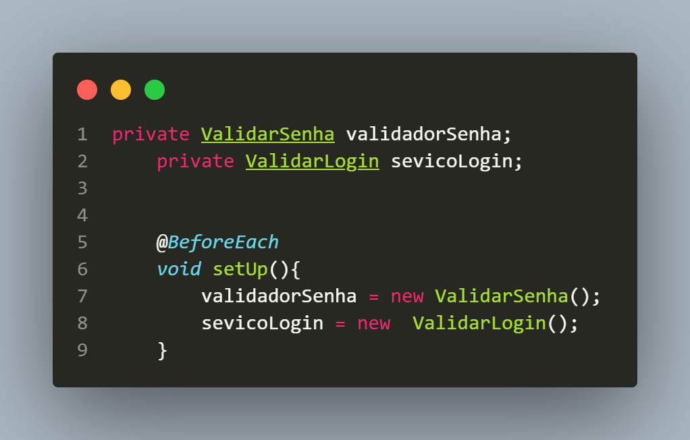
 
---
 
## 4. Dependências Utilizadas
 
### ❓ Quais dependências o projeto usa?
 
**✅ Resposta:** apenas o **JUnit Jupiter 5.10.2**, que já reúne API, Engine e suporte a testes parametrizados em um único artefato, com escopo `test`. O projeto usa **Java 23** e dois plugins Maven: `maven-compiler-plugin` e `maven-surefire-plugin` (este executa os testes).
 
```xml
<?xml version="1.0" encoding="UTF-8"?>
<project xmlns="http://maven.apache.org/POM/4.0.0"
         xmlns:xsi="http://www.w3.org/2001/XMLSchema-instance"
         xsi:schemaLocation="http://maven.apache.org/POM/4.0.0 http://maven.apache.org/xsd/maven-4.0.0.xsd">
    <modelVersion>4.0.0</modelVersion>
 
    <groupId>validar.login</groupId>
    <artifactId>Validar-junit5</artifactId>
    <version>1.0-SNAPSHOT</version>
 
    <properties>
        <maven.compiler.release>23</maven.compiler.release>
        <project.build.sourceEncoding>UTF-8</project.build.sourceEncoding>
    </properties>
 
    <dependencies>
        <dependency>
            <groupId>org.junit.jupiter</groupId>
            <artifactId>junit-jupiter</artifactId>
            <version>5.10.2</version>
            <scope>test</scope>
        </dependency>
    </dependencies>
 
    <build>
        <plugins>
            <plugin>
                <groupId>org.apache.maven.plugins</groupId>
                <artifactId>maven-compiler-plugin</artifactId>
                <version>3.13.0</version>
            </plugin>
            <plugin>
                <groupId>org.apache.maven.plugins</groupId>
                <artifactId>maven-surefire-plugin</artifactId>
                <version>3.2.5</version>
            </plugin>
        </plugins>
    </build>
</project>
```
 
> 💡 **Para rodar os testes:** `mvn test`
 
---
 
## 5. Demonstração de Cada Código
 
> As imagens (capturas do CodeSnap) ficam em **`docs/img/`**.
 
### 5.1 Código-fonte do sistema
 
#### ❓ Como é o enum `NivelUsuario`?
 
**✅ Resposta:** define os três níveis de acesso possíveis.
 
```java
package validar.login.model.enums;
 
public enum NivelUsuario {
    ADMIN,
    GERENTE,
    CLIENTE
}
```
 
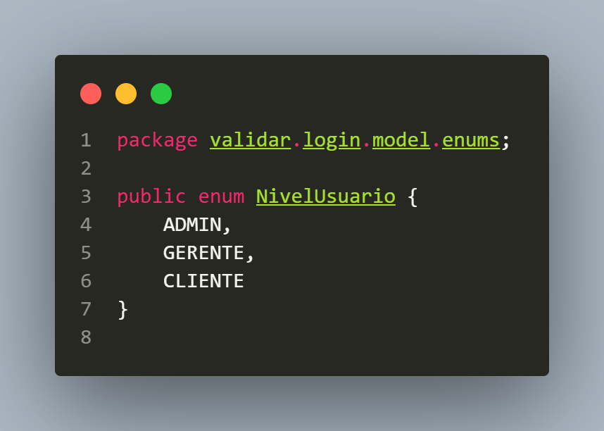
 
#### ❓ Como é a classe `Usuario`?
 
**✅ Resposta:** guarda os dados do usuário e controla as tentativas inválidas e o bloqueio. Quando `tentativasInvalidas` chega a 3, `bloqueado` vira `true`.
 
```java
package validar.login.model;
 
import validar.login.model.enums.NivelUsuario;
 
public class Usuario {
    private String nome;
    private String login;
    private String email;
    private String senha;
    private NivelUsuario nivel;
    private int tentativasInvalidas;
    private boolean bloqueado;
 
    public Usuario(String nome, String login, String email, String senha, NivelUsuario nivel){
        this.nome = nome;
        this.login = login;
        this.email = email;
        this.senha = senha;
        this.nivel = nivel;
        this.tentativasInvalidas = 0;
        this.bloqueado = false;
    }
 
    // Getters e Setters
    public String getNome(){return nome;}
    public String getLogin(){return login;}
    public String getEmail(){return email;}
    public String getSenha(){return senha;}
    public NivelUsuario getNivel(){return nivel;}
    public int getTentativasInvalidas(){return tentativasInvalidas;}
    public boolean isBloqueado(){return bloqueado;}
 
    public void incrementarTentativas(){
        this.tentativasInvalidas++;
        if (this.tentativasInvalidas >= 3) {
            this.bloqueado = true;
        }
    }
 
    public void resetarTentativas(){
        this.tentativasInvalidas = 0;
    }
}
```
 
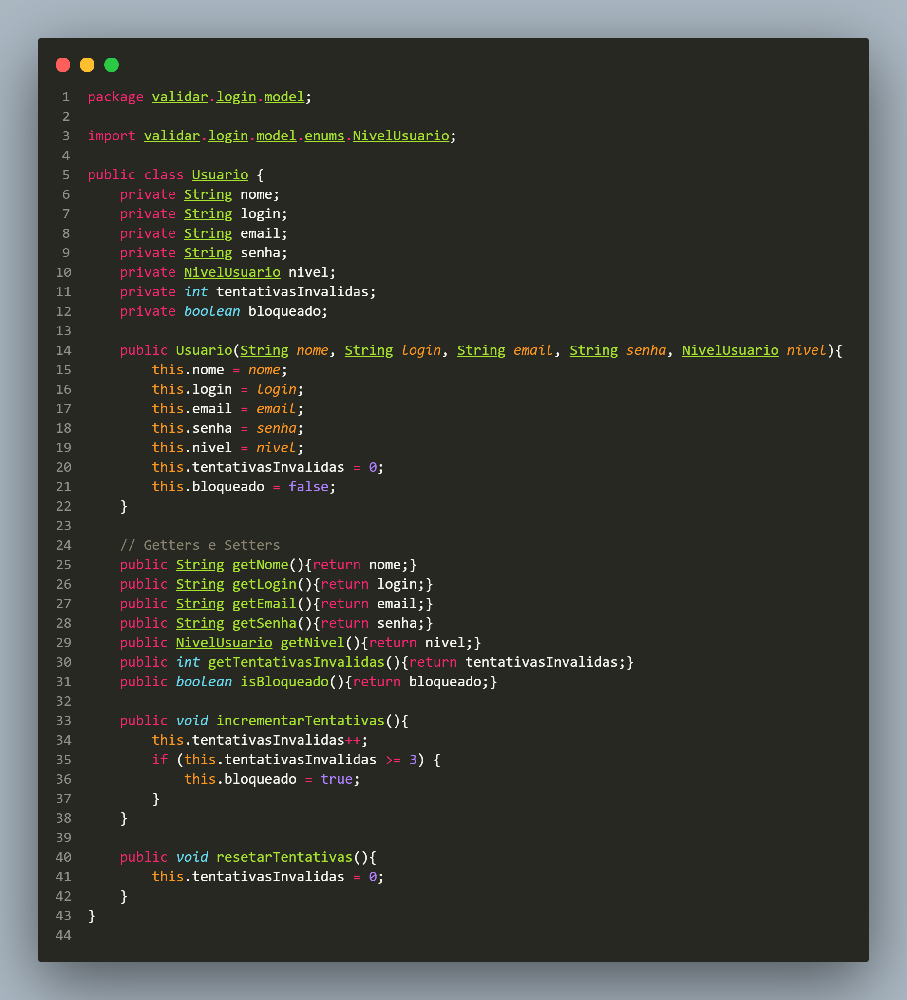
 
#### ❓ Como são as exceções customizadas?
 
**✅ Resposta:** são classes que estendem `RuntimeException`, para que o código sinalize cada tipo de erro de forma clara. O exemplo abaixo é `AutenticacaoException`; as demais (`ValidacaoException`, `NotFoundException`, `ContaBloqueadaException` e `ConexaoBancoException`) seguem o mesmo padrão.
 
```java
package validar.login.exception;
 
public class AutenticacaoException extends RuntimeException{
    public AutenticacaoException(String message){
        super(message);
    }
}
```
 
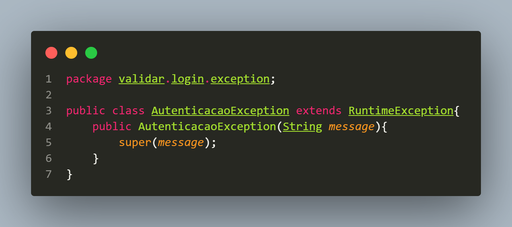
 
#### ❓ Como funciona o `ValidarNome`?
 
**✅ Resposta:** se o nome for `null` ou em branco, lança `ValidacaoException`. Caso contrário, retorna `true`.
 
```java
package validar.login;
 
import validar.login.exception.ValidacaoException;
 
public class ValidarNome {
    public boolean validarNome(String nome){
        if (nome == null || nome.isBlank()){
            throw new ValidacaoException("O nome não pode ser nulo ou vazio.\nTente novamente.");
        }
 
        return true;
    }
}
```
 
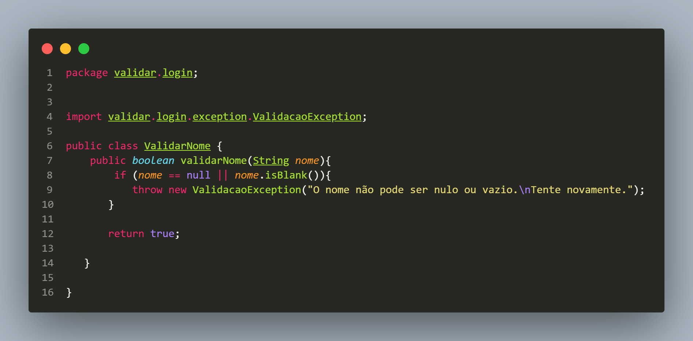
 
#### ❓ Como funciona o `ValidarEmail`?
 
**✅ Resposta:** lança `ValidacaoException` para e-mail nulo ou vazio. Para os demais, usa uma **expressão regular (regex)** e retorna `true` se o formato for válido ou `false` se não for.
 
```java
package validar.login;
 
import validar.login.exception.ValidacaoException;
 
public class ValidarEmail {
    public boolean validar(String email){
        if (email == null || email.isBlank()) {
            throw new ValidacaoException("O Email não pode ser nulo ou vazio.\nTente novamente.");
        }
 
        String regexEmail = "^[A-Za-z0-9+_.-]+@[A-Za-z0-9.-]+\\.[a-zA-Z]{2,}$";
 
        if (!email.matches(regexEmail)) {
            return false;
        }
 
        return true;
    }
}
```
 
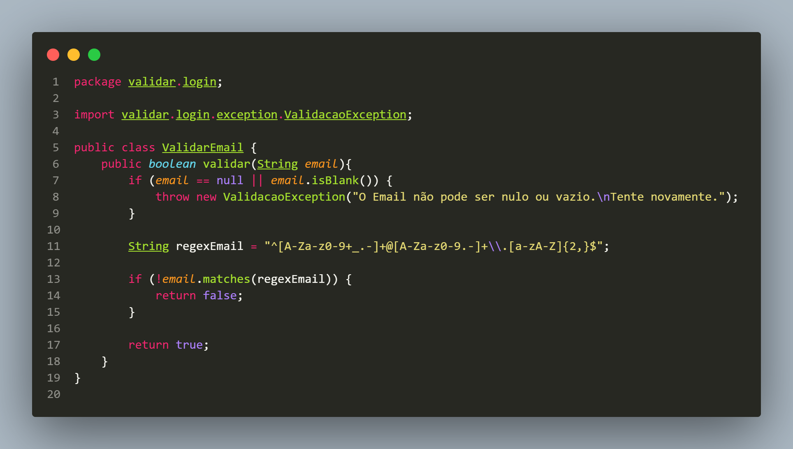
 
#### ❓ Como funciona o `ValidarSenha`? (classe principal dos testes)
 
**✅ Resposta:** retorna `false` se a senha for nula/vazia ou se o tamanho estiver fora de 10–12. Depois usa três regex para checar número, letra e caractere especial, e só retorna `true` se **todas** forem atendidas.
 
```java
package validar.login;
 
import validar.login.exception.NotFoundException;
 
public class ValidarSenha {
    public boolean validarSenha(String senha) {
        if (senha == null || senha.isBlank()) {
            return false;
        }
        if (senha.length() < 10 || senha.length() > 12) {
            return false;
        }
        boolean possuiNumero =
                senha.matches(".*\\d.*");
        boolean possuiLetra =
                senha.matches(".*[a-zA-Z].*");
        boolean possuiEspecial =
                senha.matches(".*[!@#$%&*()].*");
        return possuiNumero &&
                possuiLetra &&
                possuiEspecial;
    }
 
    public boolean validarEmail(String email){
        if (email == null || email.isBlank()){
            throw new NotFoundException("Email não encontrado!!");
        }
 
        boolean emailCorreto = email.matches(".*[@]*.");
 
        boolean emailVerdadeiro = emailCorreto;
 
        return emailVerdadeiro;
    }
}
```
 
| Regex | O que verifica |
|-------|----------------|
| `.*\\d.*` | Pelo menos um **dígito** |
| `.*[a-zA-Z].*` | Pelo menos uma **letra** |
| `.*[!@#$%&*()].*` | Pelo menos um **caractere especial** da lista `! @ # $ % & * ( )` |
 
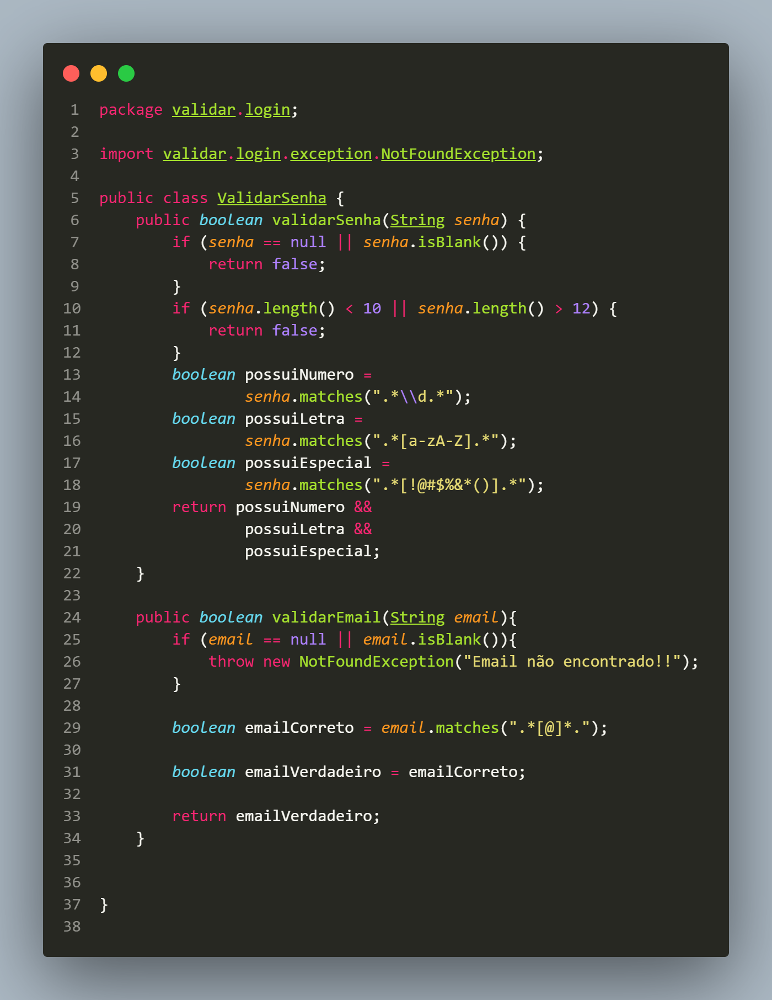
 
#### ❓ Como funciona o `ValidarLogin`?
 
**✅ Resposta:** é o "serviço" do sistema. Usa um `HashMap` como banco de dados em memória e oferece:
 
- `cadastrarUsuario(...)`: valida nome, e-mail, login e senha antes de salvar.
- `autenticar(login, senha)`: valida os campos, verifica se o usuário existe e se está bloqueado, compara a senha e controla as tentativas.
- `verificarConexaoBanco()`: simula uma falha de conexão (`ConexaoBancoException`).
```java
package validar.login;
 
import java.util.HashMap;
import java.util.Map;
 
import validar.login.exception.AutenticacaoException;
import validar.login.exception.ConexaoBancoException;
import validar.login.exception.ContaBloqueadaException;
import validar.login.exception.NotFoundException;
import validar.login.exception.ValidacaoException;
import validar.login.model.Usuario;
 
public class ValidarLogin {
    private final ValidarSenha validarSenha = new ValidarSenha();
    private final ValidarNome validarNome = new ValidarNome();
    private final ValidarEmail validarEmail = new ValidarEmail();
 
    // Simulação de Banco de Dados em Memória, já que não iremos por o Hibernate(H2)
    private final Map<String, Usuario>bancoUsuarios = new HashMap<>();
    private boolean bancoConectado = true;
 
    public void setBancoConectado(boolean status){
        this.bancoConectado = status;
    }
 
    public void cadastrarUsuario(Usuario usuario){
        verificarConexaoBanco();
 
        if (usuario == null) {
            throw new ValidacaoException("Usuário não pode ser nulo.");
        }
 
        validarNome.validarNome(usuario.getNome());
        validarEmail.validar(usuario.getEmail());
 
        if (usuario.getLogin() == null || usuario.getLogin().isBlank()) {
            throw new ValidacaoException("Login é obrigatório.");
        }
 
        if (!validarSenha.validarSenha(usuario.getSenha())) {
            throw new ValidacaoException("Senha inválida segundo os requisitos de segurança.");
        }
 
        bancoUsuarios.put(usuario.getLogin(), usuario);
    }
 
    public boolean autenticar(String login, String senha){
        verificarConexaoBanco();
 
        if (login == null || login.isBlank() || senha == null || senha.isBlank()) {
            throw new ValidacaoException("Login e senha são obrigatórios.");
        }
 
        if (!bancoUsuarios.containsKey(login)) {
            throw new NotFoundException("Usuário não encontrado.");
        }
 
        Usuario usuario = bancoUsuarios.get(login);
 
        if (usuario.isBloqueado()) {
            throw new ContaBloqueadaException("Conta bloqueada por excesso de tentativas incorretas.");
        }
 
        if (usuario.getSenha().equals(senha) && validarSenha.validarSenha(senha)) {
            usuario.resetarTentativas();
            return true;
        }else{
            usuario.incrementarTentativas();
            throw new AutenticacaoException("Senha incorreta.\nTente novamente.");
        }
    }
 
    private void verificarConexaoBanco(){
        if (!bancoConectado) {
            throw new ConexaoBancoException("Erro de conexão com o banco de dados.");
        }
    }
}
```
 
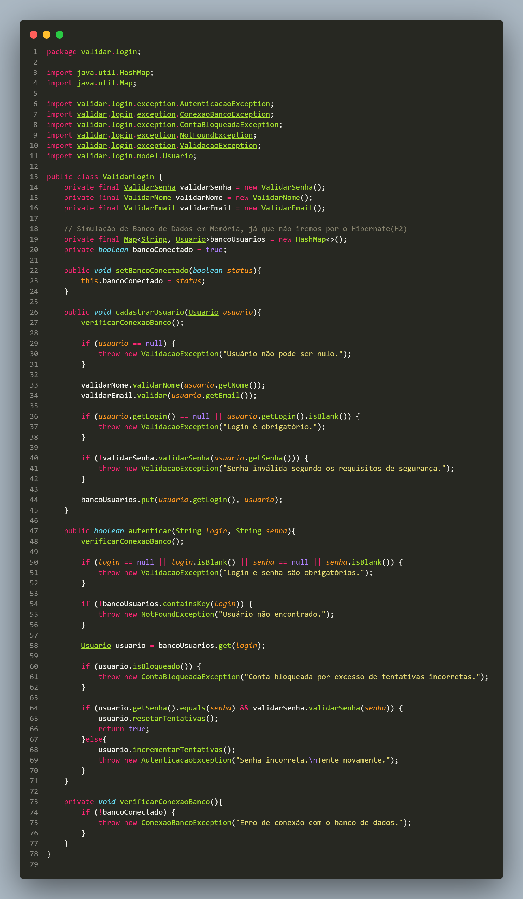
 
> 🔎 **Observe a ordem das verificações em `autenticar`:** campos vazios → usuário existe? → conta bloqueada? → senha correta? Por isso a 4ª tentativa lança `ContaBloqueadaException` mesmo com a senha certa.
 
#### ❓ Como é a classe `App`?
 
**✅ Resposta:** é uma demonstração rápida. Instancia os validadores e imprime no console o resultado da validação de um nome, e-mail e senha de exemplo.
 
```java
package validar.login;
 
public final class App {
 
    private App() {
    }
    public static void main(String[] args) {
        ValidarNome nome = new ValidarNome();
        ValidarEmail email = new ValidarEmail();
        ValidarSenha senha = new ValidarSenha();
 
 
        System.out.println("Validação de usuário!!!!");
        System.out.println("Nome: " + nome.validarNome("Float"));
        System.out.println("Email: " + email.validar("float@gmail.com"));
        System.out.println("Senha: " + senha.validarSenha("Flo4t1ngM5t@"));
    }
 
}
```
 
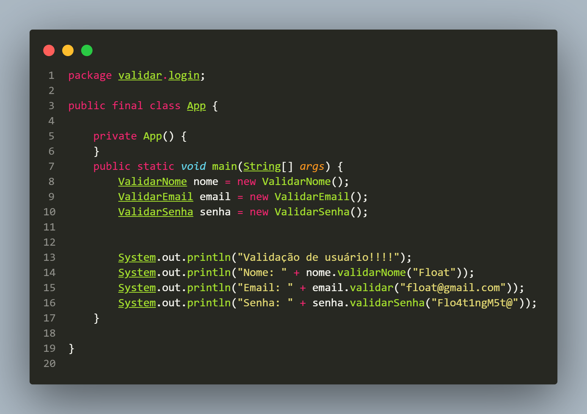
 
#### ❓ E a classe `Main`?
 
**✅ Resposta:** é o arquivo de exemplo gerado automaticamente pelo IntelliJ IDEA ("Hello and welcome!"). **Não tem função no sistema** e pode ser removido.
 
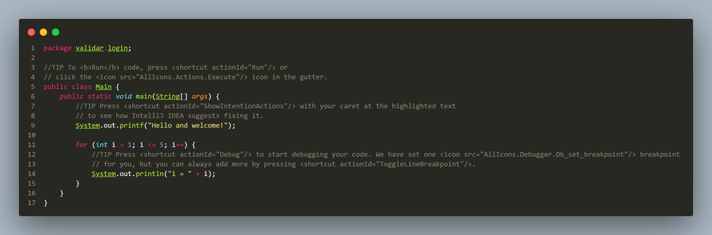
 
---
 
### 5.2 Testes de validação de senha
 
#### ❓ Teste 1 · CT01/CT09: uma senha com 10 caracteres é aceita?
 
**✅ Resposta:** sim. O teste verifica duas senhas válidas. `Java@12345` tem exatamente 10 caracteres. `Java@123456` tem 11, mas também passa, pois o intervalo aceito é de 10 a 12.
 
```java
@Test
@DisplayName("CT01/CT09 - Senha válida com exatamente 10 caracteres")
void testeSenhaValida10Caracteres(){
    Assertions.assertTrue(validadorSenha.validarSenha("Java@123456"));
    Assertions.assertTrue(validadorSenha.validarSenha("Java@12345"));
}
```
 
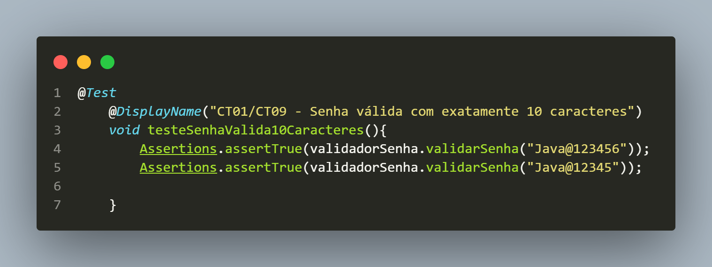
 
**Resultado:**
 
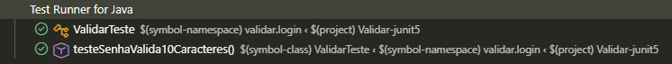
 
#### ❓ Teste 2 · CT02/CT13: uma senha com 9 caracteres é rejeitada?
 
**✅ Resposta:** sim. `Java@1234` tem 9 caracteres, abaixo do mínimo, e o método retorna `false`.
 
```java
@Test
@DisplayName("CT02/CT13 - Senha menor que 10 caracteres (9)")
void testeSenhaMenorQueMinimo(){
    Assertions.assertFalse(validadorSenha.validarSenha("Java@1234"));
}
```
 
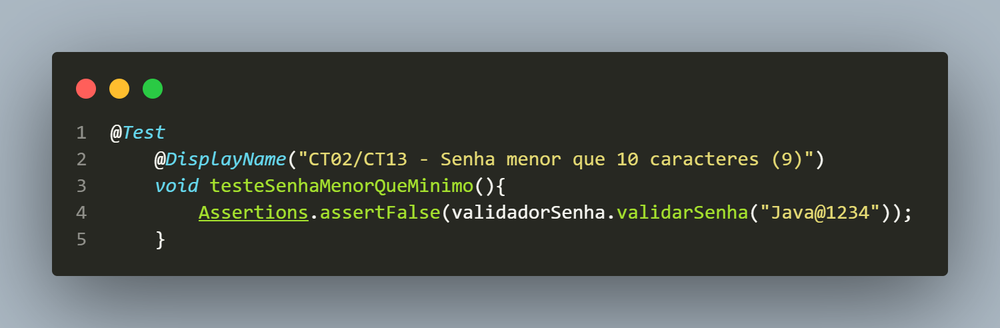
 
**Resultado:**
 
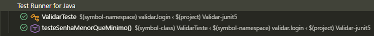
 
#### ❓ Teste 3.5 · CT10/CT12: uma senha com 12 caracteres (limite máximo) é aceita?
 
**✅ Resposta:** sim. `Java@1234567` tem exatamente 12 caracteres e satisfaz todas as regras.
 
```java
@Test
@DisplayName("CT10/CT12 - Senha limite máximo de 12 caracteres")
void  testeSenhaLimiteMaximo12(){
    Assertions.assertTrue(validadorSenha.validarSenha("Java@1234567"));
}
```
 

 
**Resultado:**
 

 
#### ❓ Teste 3 · CT03: uma senha com mais de 12 caracteres é rejeitada?
 
**✅ Resposta:** sim. `Java@123456789` (14 caracteres) ultrapassa o limite e retorna `false`.
 
```java
@Test
@DisplayName("CT03 - Senha maior que 12 caracteres (13 caracteres+)")
void testeSenhaMaiorQueMaximo(){
    Assertions.assertFalse(validadorSenha.validarSenha("Java@123456789"));
}
```
 
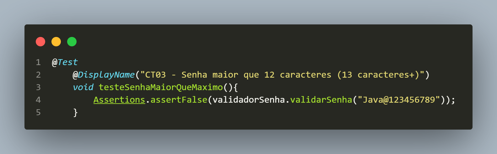
 
**Resultado:**
 
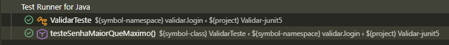
 
#### ❓ Teste 4 · CT04/CT14: uma senha sem caractere especial é rejeitada?
 
**✅ Resposta:** sim. `Java1234567` tem 11 caracteres, letras e números, mas nenhum caractere especial.
 
```java
@Test
@DisplayName("CT04/CT14 - Senha sem caractere especial")
void testeSenhaSemEspecial(){
    Assertions.assertFalse(validadorSenha.validarSenha("Java1234567"));
}
```
 
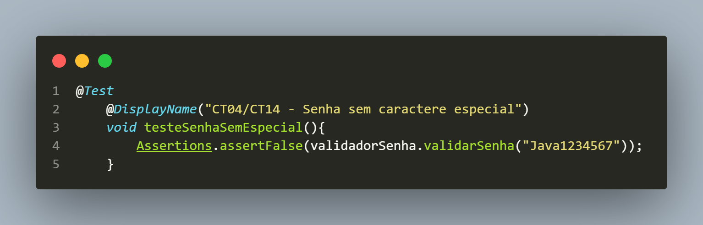
 
**Resultado:**
 
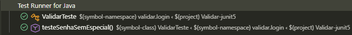
 
#### ❓ Teste 5 · CT05/CT15: uma senha sem letra é rejeitada?
 
**✅ Resposta:** sim. `123456@7890` tem 11 caracteres, números e um especial, mas nenhuma letra.
 
```java
@Test
@DisplayName("CT05/CT15 - Senha sem letra")
void testeSenhaSemLetra(){
    Assertions.assertFalse(validadorSenha.validarSenha("123456@7890"));
}
```
 
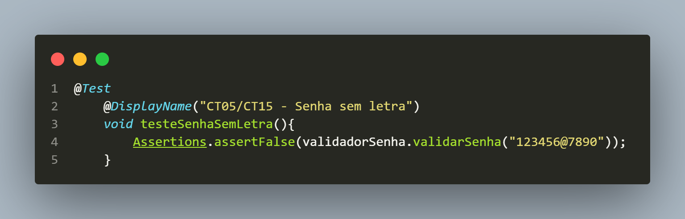
 
**Resultado:**
 
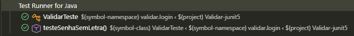
 
#### ❓ Teste 6 · CT06/CT16: uma senha sem número é rejeitada?
 
**✅ Resposta:** sim. `Java@Special` tem 12 caracteres, letras e um especial, mas nenhum número.
 
```java
@Test
@DisplayName("CT06/CT16 - Senha sem número")
void testeSenhaSemNumero(){
    Assertions.assertFalse(validadorSenha.validarSenha("Java@Special"));
}
```
 
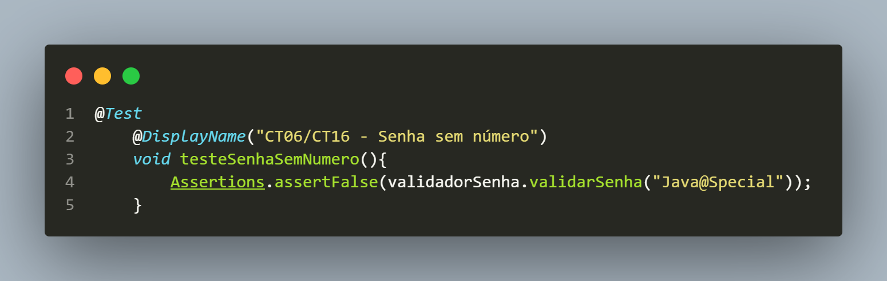
 
**Resultado:**
 
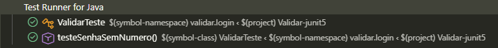
 
#### ❓ Teste 7 · CT07: o que acontece com senha nula?
 
**✅ Resposta:** o método não quebra com `NullPointerException`; ele trata o `null` e retorna `false`.
 
```java
@Test
@DisplayName("CT07 - Senha 'Nula'")
void testeSenhaNula(){
    Assertions.assertFalse(validadorSenha.validarSenha(null));
}
```
 
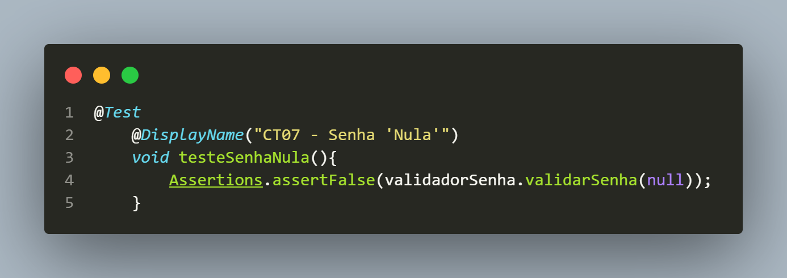
 
**Resultado:**
 
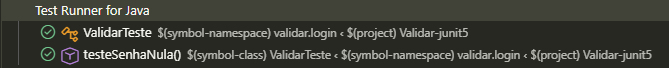
 
#### ❓ Teste 8 · CT08: o que acontece com senha vazia?
 
**✅ Resposta:** uma string vazia `""` também é rejeitada e retorna `false`.
 
```java
@Test
@DisplayName("CT08 - Senha Vazia")
void testSenhaVazia(){
    assertFalse(validadorSenha.validarSenha(""));
}
```
 
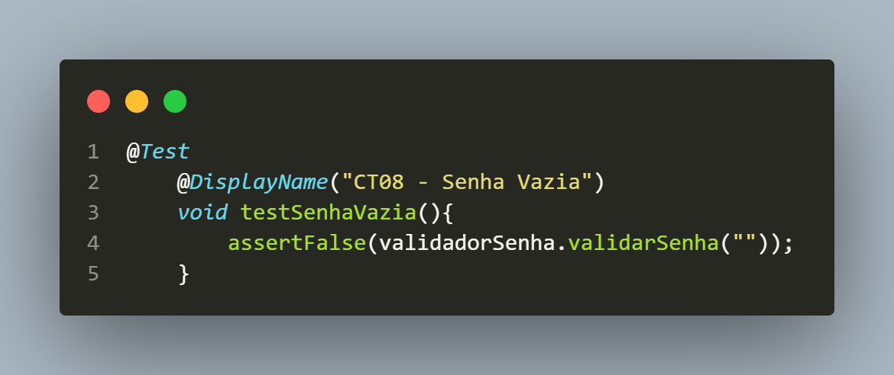
 
**Resultado:**
 
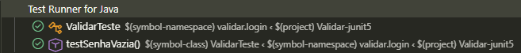
 
---
 
### 5.3 Testes de requisitos funcionais e regras
 
#### ❓ Regra 1 · RF01/RF08: é possível cadastrar um usuário ADMIN?
 
**✅ Resposta:** sim. Com dados válidos, `cadastrarUsuario` não lança exceção, o que é verificado com `assertDoesNotThrow`.
 
```java
//-- Teste de REQUISITOS FUNCIONAIS e REGRAS ----------------------------------------
 
@Test
@DisplayName("RF01/RF08 - Cadastro de Usuário com Nível ADMIN")
void testeCadastroUsuarioComSucesso(){
    Usuario usuario = new Usuario("Float", "Float999", "float@email.com", "Java@123456", NivelUsuario.ADMIN);
 
    assertDoesNotThrow(() -> sevicoLogin.cadastrarUsuario(usuario));
}
```
 
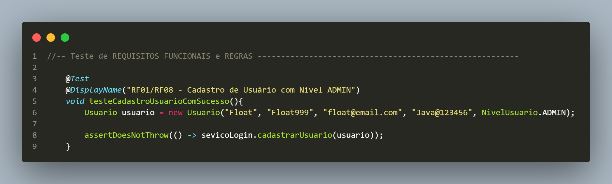
 
**Resultado:**
 
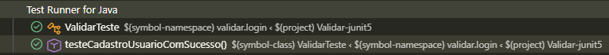
 
#### ❓ Regra 2 · RF04/RF06: o que acontece ao autenticar com campos vazios?
 
**✅ Resposta:** o sistema lança `ValidacaoException`.
 
```java
@Test
@DisplayName("RF04/RF06 - Erro ao autenticar com campos vazios")
void testeAutenticacaoCamposVazios(){
    assertThrows(ValidacaoException.class, () -> sevicoLogin.autenticar("", ""));
}
```
 
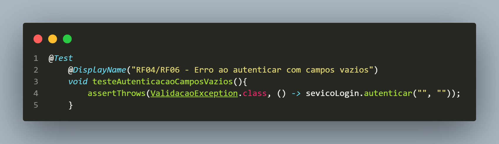
 
**Resultado:**
 
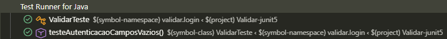
 
#### ❓ Regra 3 · RF06: o que acontece ao autenticar um usuário inexistente?
 
**✅ Resposta:** o sistema lança `NotFoundException`, pois o login `naoExiste` não foi cadastrado.
 
```java
@Test
@DisplayName("RF06 - Exceção ao tentar logar com Usuário Inexistente")
void testeUsuarioInexistente(){
    assertThrows(NotFoundException.class, () -> sevicoLogin.autenticar("naoExiste", "Java@123456"));
}
```
 
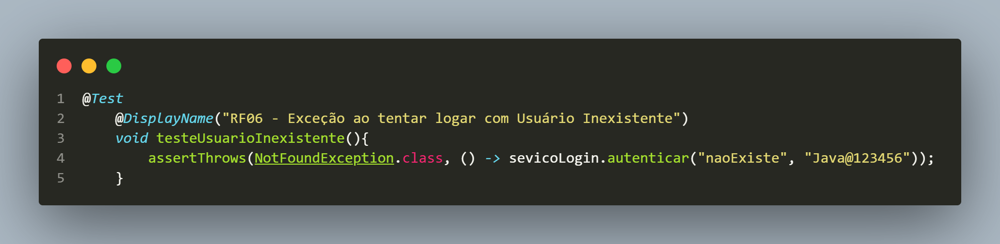
 
**Resultado:**
 
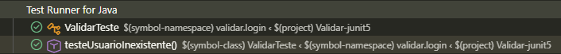
 
#### ❓ Regra 4 · RF07: como funciona o bloqueio após 3 tentativas erradas?
 
**✅ Resposta:** o teste cadastra um usuário e tenta autenticar 3 vezes com a senha errada. Cada falha lança `AutenticacaoException`; na 3ª, a conta é bloqueada. Na 4ª tentativa, **mesmo com a senha correta**, lança `ContaBloqueadaException`.
 
| Tentativa | Senha enviada | Exceção esperada | Estado da conta |
|-----------|---------------|------------------|-----------------|
| 1ª | Errada | `AutenticacaoException` | 1 falha |
| 2ª | Errada | `AutenticacaoException` | 2 falhas |
| 3ª | Errada | `AutenticacaoException` | 3 falhas → **bloqueada** |
| 4ª | Correta | `ContaBloqueadaException` | bloqueada |
 
```java
@Test
@DisplayName("RF07 - Bloqueio de conta após 3 tentativas inválidas consecutivas")
void testeBloqueioContaApos3Tentativas(){
    Usuario usuario = new Usuario("Float", "floatOMEGA", "float@email.com", "Java@123456", NivelUsuario.CLIENTE);
 
    sevicoLogin.cadastrarUsuario(usuario);
 
    //-- 1º Tentativa
    assertThrows(AutenticacaoException.class, () -> sevicoLogin.autenticar("floatOMEGA", "Errada@1234"));
 
    //-- 2º Tentativa
    assertThrows(AutenticacaoException.class, () -> sevicoLogin.autenticar("floatOMEGA", "Errada@1234"));
 
    //-- 3º Tentativa:Bloqueado
    assertThrows(AutenticacaoException.class, () -> sevicoLogin.autenticar("floatOMEGA", "Errada@1234"));
 
    //-- 4º Tentativa:Conta já bloqueada
    assertThrows(ContaBloqueadaException.class, () -> sevicoLogin.autenticar("floatOMEGA", "Java@123456"));
}
```
 
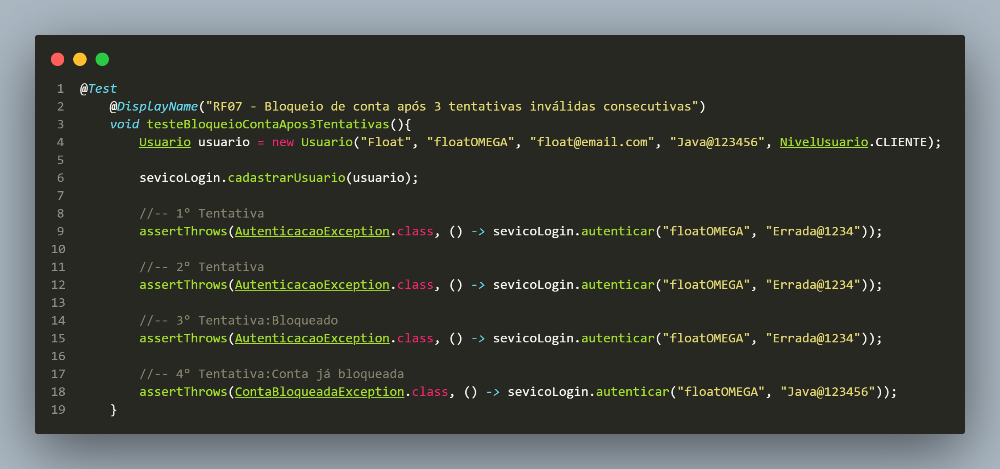
 
**Resultado:**
 
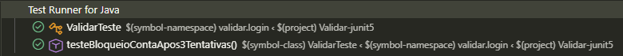
 
---
 
## 6. O Que Cada Script Faz
 
### ❓ Qual a responsabilidade de cada classe do sistema?
 
**✅ Resposta:**
 
| Script | Pacote | Responsabilidade |
|--------|--------|------------------|
| `NivelUsuario` | `model.enums` | Enum com os níveis de acesso: `ADMIN`, `GERENTE` e `CLIENTE`. |
| `Usuario` | `model` | Entidade de domínio: nome, login, e-mail, senha, nível, contador de tentativas inválidas e status de bloqueio. |
| `*Exception` | `exception` | Exceções customizadas (`ValidacaoException`, `NotFoundException`, `AutenticacaoException`, `ContaBloqueadaException`, `ConexaoBancoException`) que identificam cada tipo de erro. |
| `ValidarNome` | `validar.login` | Valida o nome; lança `ValidacaoException` se for nulo ou vazio. |
| `ValidarEmail` | `validar.login` | Valida o e-mail; lança `ValidacaoException` se for nulo/vazio e usa regex para checar o formato. |
| `ValidarSenha` | `validar.login` | Regras puras da senha: tamanho de 10 a 12, nulo/vazio e presença de letra, número e caractere especial. |
| `ValidarLogin` | `validar.login` | Serviço de login: cadastra usuários em memória (`HashMap`), autentica, conta tentativas inválidas e bloqueia a conta após 3 falhas. |
| `App` | `validar.login` | Demonstração no console dos validadores de nome, e-mail e senha. |
| `Main` | `validar.login` | Template padrão do IntelliJ, sem função no sistema. |
| `ValidarTeste` | `src/test` | Suíte de **13 testes** JUnit 5 que cobre todas as regras e exceções. |
 
---
 
## 7. Estrutura do Repositório
 
### ❓ Onde ficam as imagens e como o projeto está organizado?
 
**✅ Resposta:** as imagens do CodeSnap ficam em **`docs/img/`**, na raiz do repositório. O `README.md` as referencia com caminho relativo (`docs/img/nome.png`), o que faz o GitHub exibi-las corretamente.
 
```text
atv-teste-login/
├── pom.xml
├── README.md
├── docs/
│   └── img/
│       ├── 01-enum-nivel-usuario.png
│       ├── 02-model-usuario.png
│       ├── 03-exception-exemplo-exception-customizadas.png
│       ├── 04-validador-validar-nome.png
│       ├── 05-validador-validar-email.png
│       ├── 06-validador-validar-senha.png
│       ├── 07-validador-validar-login.png
│       ├── 08-app-app.png
│       ├── 09-app-main.png
│       ├── 10-teste-setup.png
│       ├── 11-teste-validar-teste1-senha-10-caracteres.png
│       ├── 11-teste-resultado.png
│       ├── 12-teste-validar-teste2-senha-menor-minimo.png
│       ├── 12-teste-resultado.png
│       ├── 13_5-teste-validar-teste3_5-senha-limite-maximo12.png
│       ├── 13_5-teste-resultado.png
│       ├── 13-teste-validar-teste3-senha-maior-maximo.png
│       ├── 13-teste-resultado.png
│       ├── 14-teste-validar-teste4-senha-sem-especial.png
│       ├── 14-teste-resultado.png
│       ├── 15-teste-validar-teste5-senha-sem-letra.png
│       ├── 15-teste-resultado.png
│       ├── 16-teste-validar-teste6-senha-sem-numero.png
│       ├── 16-teste-resultado.png
│       ├── 17-teste-validar-teste7-senha-nula.png
│       ├── 17-teste-resultado.png
│       ├── 18-teste-validar-teste8-senha-vazia.png
│       ├── 18-teste-resultado.png
│       ├── 19-teste-validar-regras1-cadastro-usuario-admin.png
│       ├── 19-teste-resultado.png
│       ├── 20-teste-validar-regras2-erro-autenticar-campos-vazios.png
│       ├── 20-teste-resultado.png
│       ├── 21-teste-validar-regras3-usuario-inexistente.png
│       ├── 21-teste-resultado.png
│       ├── 22-teste-validar-regras4-bloqueio-3-tentativas.png
│       └── 22-teste-resultado.png
└── src/
    ├── main/java/validar/login/
    │   ├── App.java
    │   ├── Main.java
    │   ├── ValidarEmail.java
    │   ├── ValidarLogin.java
    │   ├── ValidarNome.java
    │   ├── ValidarSenha.java
    │   ├── exception/
    │   └── model/
    │       ├── Usuario.java
    │       └── enums/NivelUsuario.java
    └── test/java/validar/login/
        └── ValidarTeste.java
```
 
---
 
## ✅ Conclusão
 
Os **13 testes** da classe `ValidarTeste` foram executados com sucesso, confirmando que:
 
- a senha é aceita **apenas** com 10 a 12 caracteres, com letra, número e caractere especial;
- valores nulos e vazios são tratados sem quebrar o sistema;
- o cadastro e a autenticação lançam as exceções corretas em cada situação;
- a conta é bloqueada após 3 tentativas incorretas consecutivas.